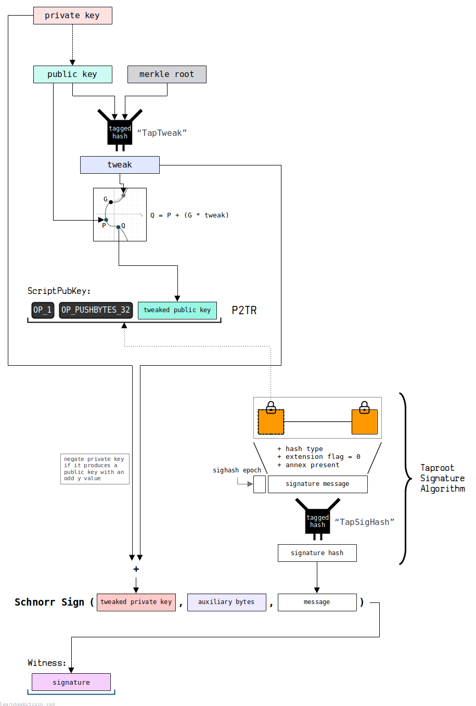
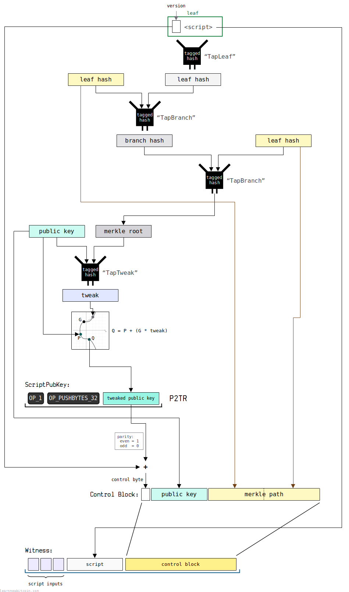

## taproot tree
### taproot-key-path-spend

> Reference: [taproot-key-path-spend](https://static.learnmeabitcoin.com/diagrams/png/taproot-key-path-spend.png)
### taproot-script-path-spend

> Reference: [taproot-script-path-spend](https://static.learnmeabitcoin.com/diagrams/png/taproot-script-path-spend.png)

## Reference
* https://learnmeabitcoin.com/technical/upgrades/taproot/
* https://developer.bitcoin.org/reference/rpc/